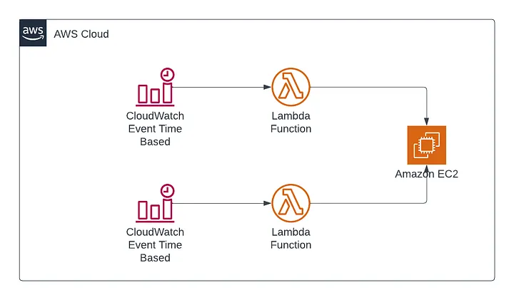

# Serverless EC2 Instance Scheduler for Company Working Hours 
## Scenario :
In some companies, there is no need to run their EC2 instances 24/7; they require instances to operate during specific time periods, such as company working hours, from 8:00 AM in the morning to 5:00 PM in the evening. To address this scenario, I will implement two Lambda functions responsible for starting and stopping instances. These Lambda functions will be triggered by two CloudWatch Events in the morning and evening. This solution is fully serverless.

## Steps :

### Step 1 :
### Creating the Instance :
1. Navigate to the EC2 Console.
2. Follow the Outlined steps below.

### Step 2 :
### Creating the Policy :

1. Navigate to the IAM Console.
2. Click on "Policies" and then Click on "Create policy"
3. Select services as EC2.
4. And Actions are DescribeInstances , StartInstances.
5. Now we have created a policy for starting instances. We also need to create a policy for stopping the instances. This is because we are going to create two Lambda functions: one for starting and one for stopping the instances. Each function will have its own role, and we will attach these two policies to their respective roles. 
6. Now  we are going to repeat the same steps for Creating Stopping Policy also. 
7. Everything is same , Except Actions because we are going to stop the instance. 
8. The Actions are DescribeInstances , StopInstances . 
9. Keep your Plolicy name as "stop-ec2-instance".

## Step 3 :
## Creating the Lambda functions :

1. Navigate to the lambda Console.
2. Then Follow the Outlined steps on AWS Consol.
3. Now we Created  alambda function for Starting Instance.
4. We have to Reapeat the same steps again to Create a Lambda function for Stopping Instance , Keep your lambda function name as "Stop-EC2-demo".
5. The only changes we have to make are to replace the default code with the 'stop-ec2-instance.py' code and attach the policy we created for stopping instances to the role of this Lambda function.
6. As demonstrated above, when I test my Python code, it runs successfully and stops the instance.
7. Now, we are ready to proceed and create schedules for this functions.

### Step 5 :
### Creating the Schedules Using Cloud Watch :

1. Navigate to the Cloud Watch Console.
2. Follow the Outlined Steps below.
Note : Keep your rule name as "start-ec2-rule"

3. We have now created a schedule for starting the instance every day at 8:00 AM. 
4. Next, we need to create a schedule for stopping instances. 
5. To create the schedule for stopping instances, follow the same steps as for starting instance scheduling with a few changes, Keep your rule name as "stop-ec2-rule". 
6. The changes include modifying the scheduled time and selecting the appropriate scheduling function. 
7. We need to change the schedule time to 17:00 because it will stop the Lambda function at 17:00 IST (5:00 PM).
8. We have to Change the Function as Stop-EC2-demo
9. Now, we have successfully created two schedules: one to start the instance every day at 8:00 AM and the other to stop the instance every day at 5:00 PM.

